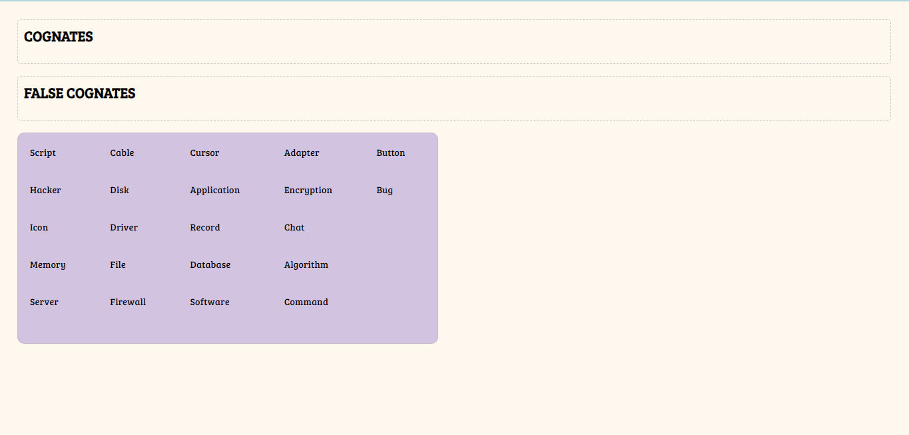

# Projeto Cognates Game

O Projeto Cognates Game é uma aplicação interativa desenvolvida para auxiliar no aprendizado de vocabulário em diferentes idiomas, com foco especial em cognatos e falsos cognatos.

## Sobre Cognatos e Falsos Cognatos

Cognatos são palavras que têm origem comum e, portanto, são semelhantes em dois idiomas diferentes. Por exemplo, "computer" em inglês e "computador" em português são cognatos. Essas palavras compartilham uma raiz etimológica comum.

Por outro lado, falsos cognatos são palavras que aparentam ter relação de significado entre dois idiomas, mas, na verdade, têm significados diferentes. Por exemplo, "push" em inglês significa "empurrar", mas em português a palavra nos remete ao "puxe" de puxar.

## Funcionalidades Principais

- **Jogo Interativo:** Os jogadores são desafiados a classificar palavras em duas categorias: cognatos e falsos cognatos.
- **Arrastar e Soltar:** Interface intuitiva que permite aos jogadores arrastar palavras para os campos correspondentes.
- **Feedback Visual:** Feedback imediato para respostas corretas e incorretas.
- **Reinício:** Funcionalidade de reinício para permitir que os jogadores pratiquem novamente.

## Captura de Tela

## Tecnologias Utilizadas

- HTML
- CSS
- JavaScript
- JQuery

## Como Usar

1. Faça um clone deste repositório.
2. Abra o arquivo `index.html` em seu navegador.
3. Arraste as palavras para os campos correspondentes de cognatos e falsos cognatos.
4. Receba feedback visual imediato sobre suas respostas.

## Contribuição

Contribuições são bem-vindas! Sinta-se à vontade para abrir um problema ou enviar um pull request.

## Licença

Este projeto está licenciado sob a [Licença MIT](LICENSE).
